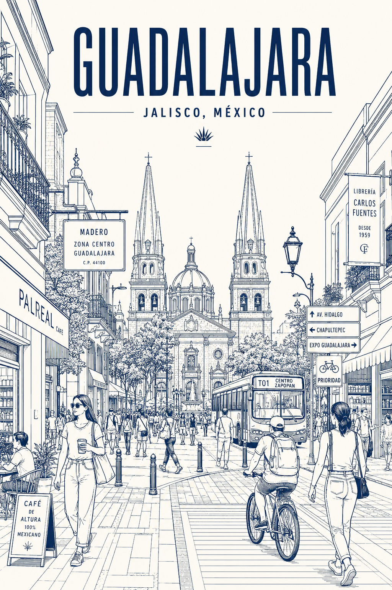

# Gallery

Generated examples created with the CityLine Poster prompt pack.

## Guadalajara, Mexico
**Generated with:** ChatGPT  
**Notes:** Clean editorial linework with a navy-on-cream palette and strong street-level structure.

## Guadalajara, Mexico — Alternate Version
**Generated with:** Microsoft Copilot  
**Notes:** Denser signage and more intricate urban texture in a terracotta-on-ivory palette.

## La Paz, Mexico
**Generated with:** Microsoft Copilot  
**Notes:** Turquoise-on-ivory palette with a bright coastal-city character.

## Zapopan, Mexico
**Generated with:** Microsoft Copilot  
**Notes:** Jade-on-ivory palette with layered storefronts and a balanced civic-street feel.

## Nochistlan, Mexico
**Generated with:** Microsoft Copilot  
**Notes:** Blue-on-off-white palette with a quieter small-city rhythm.

