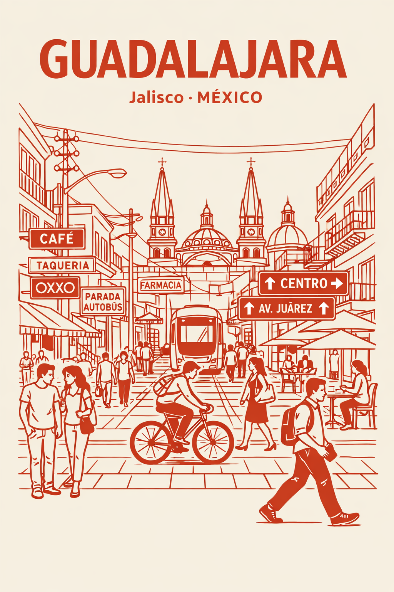
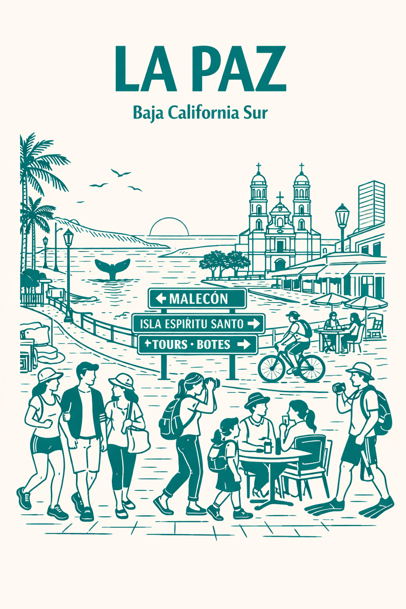
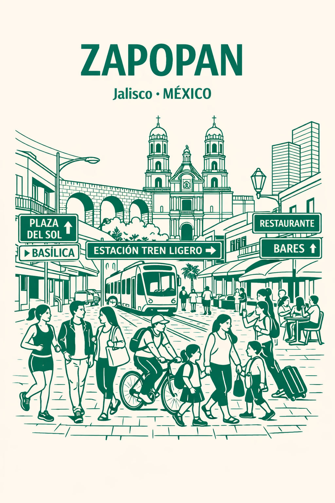

# Poster Gallery

Real outputs generated with this prompt.

## Guadalajara, Mexico — Comparison

### Microsoft Copilot
**Color:** Terracotta red on ivory

### ChatGPT
**Color:** Terracotta red on ivory

---

**Key Differences:** Both use the same prompt, but output styles vary. Copilot tends toward denser linework and more intricate signage detail. ChatGPT produces a cleaner, more stylized interpretation with slightly bolder forms.

---

## La Paz, Mexico
**Color:** Turquoise on ivory
**Generated with:** Microsoft Copilot

## Zapopan, Mexico
**Color:** Jade green on ivory
**Generated with:** Microsoft Copilot

## Nochistlan, Mexico
**Color:** Blue on off-white
**Generated with:** Microsoft Copilot

---

*Add your city! Submit a PR to contribute.*